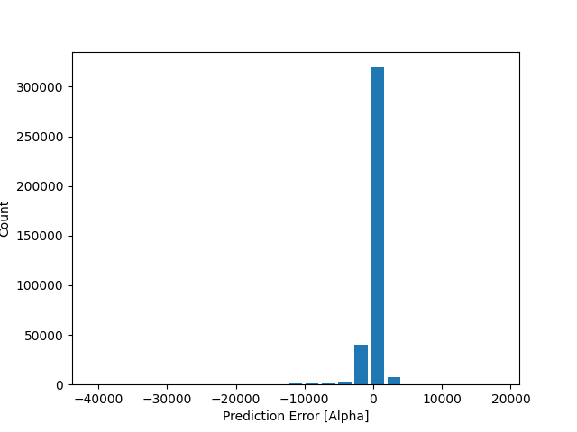
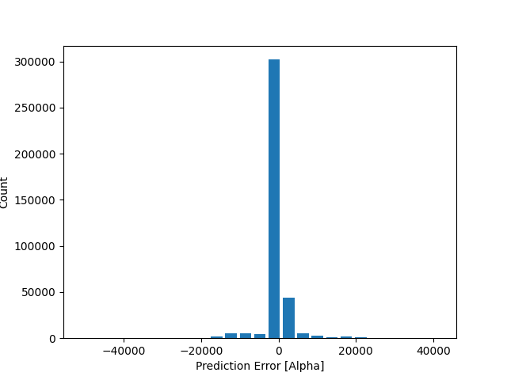
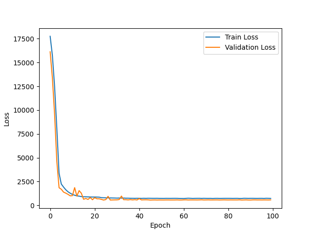

# Deep-AeroFlow: Deep Learning for Aircraft Fluid Flow Prediction


Deep-AeroFlow is a machine learning project that aims to predict fluid flow patterns on airplanes using deep learning techniques. By leveraging neural networks and advanced modeling, Deep-AeroFlow provides insights into aerodynamics and helps enhance aircraft performance.

## Table of Contents

- [Installation](#installation)
- [Usage](#usage)
- [Features and Highlights](#features-and-highlights)
- [Screenshots](#screenshots)
- [Technical Details](#technical-details)
- [Evaluation Metrics and Results](#evaluation-metrics-and-results)

## Installation

To set up Deep-AeroFlow on your system, follow these steps:

1. Clone the repository:
   ```sh
   git clone https://github.com/YajurAgarwal/Deep-AeroFlow-Prediction.git
   cd Deep-AeroFlow
  
2. Install the required dependencies:
   ```sh
   pip install -r requirements.txt

## Usage
To use Deep-AeroFlow for predicting fluid flow on airplanes:

1. Preprocess your dataset using Load_Dataset.py.
2. Train your deep learning model using the training script.
3. Evaluate the model's performance with test.py.

   
## Features and Highlights
1. Advanced deep learning model architecture
2. Efficient preprocessing of fluid flow data
3. Metrics calculation and evaluation
4. Visualization of prediction result

## Screenshots
### Error Histogram

### Histogram

### Loss VS Epoch


## Technical Details
- Neural Network Architecture: Multi-layer perceptron (MLP)
- Loss Function: Mean Absolute Error
- Optimizer: Adam
- Hidden Units: [128, 128]
- Learning Rate: 0.001
- Kernel Regularization: 1e-4

## Evaluation Metrics and Results
- Root Mean Squared Error (RMSE)
- Precision, Recall, and F1 Score
For detailed evaluation results, refer to the Metrics and Results page.
